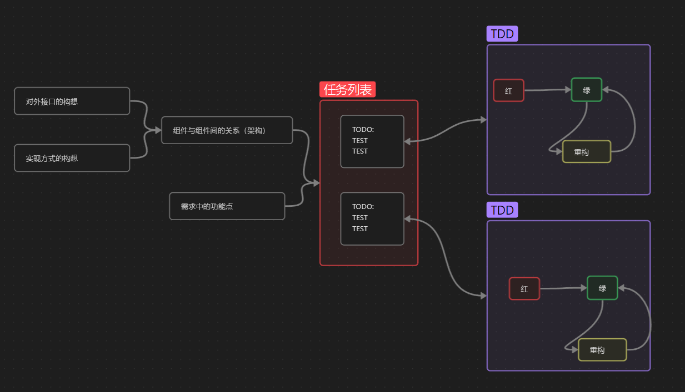

# TDD理论知识

## 目录

- [首页](./README.md)

## TDD基本原则

TDD的创始人：Kent Beck 在他的传世大作 Tese-Driven Development: By Example 中提出了TDD的基本原则

1. 当且仅当存在失败的自动化测试时，才编写生产代码
2. 消除坏味道 -> 重构

## TDD的工作步骤

1. 红：编写一个失败的小测试，甚至可以时无法编译的测试
2. 绿：让这个测试快速通过，甚至不惜犯下任何罪恶
3. 重构：消除上一步中产生的所有坏味道

> 然而红/绿/重构循环仅仅关注单个测试这个层面，它没有回答测试从何而来，
> 于是很多尝试采用TDD的人都卡在了第0步：我该写哪些测试？
> 于是作者徐浩总结了任务分解法，将任务列表作为TDD的核心要素。

## 任务分解法

1. 大致构思软件被使用的方式，把握对外接口的方向；
2. 大致构思功能的实现方式，划分所需的组件（Component）以及组件间的关系（所谓的架构）。
3. 根据需求功能描述拆分功能点，功能点要考虑 正确路径 （Happy Path）和 边界条件 (Sad Path)
4. 依照组件以及组件间的关系，将功能拆分到对应组件
5. 针对拆分的结果编写测试， 进入 红/绿/重构循环

## 小结：

至此，我们使用 TDD 的方法完成了参数解析的功能。我详细大家至少应该感受到了 TDD 这三个特点。

- 第一是，将要完成的功能分解成一系列任务，再将任务转化为测试，以测试体现研发进度，将整个开发过程变成有序的流程，以减少无效劳动。
- 第二是，在修改代码的时候，随时执行测试以验证功能，及时发现错误，降低发现、定位错误的成本，降低修改错误的难度。
- 第三是，时刻感受到认知的提升，增强自信降低恐惧。
    +在针对列表参数使用任务分解法时，你明显可以感觉到，我们无论是对需求的把握性，还是对最终实现的可预见性，都有了大幅度的提升。甚至，如果更进一步要求，我们可以较有把握地评估（误差在 15% 以内）实现列表参数解析需要多长时间。这就是我们认知提升的具体体现。

